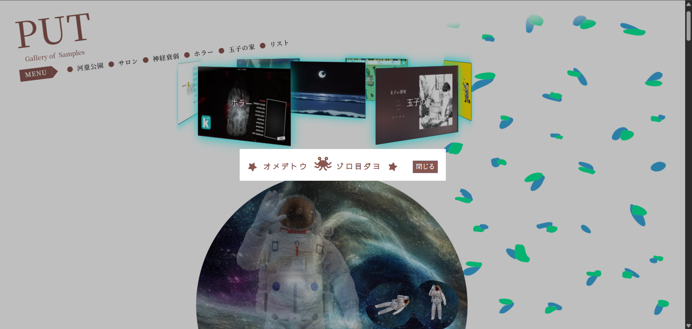
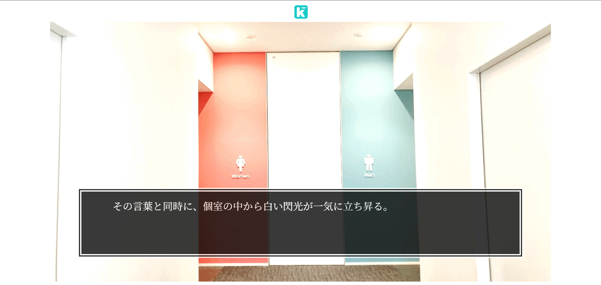

<h1 align="center">Toy Box</h1>

 

## 概要

学んだことなどを形にする場所です。

 

## サンプル

 

## 使用技術

- JavaScript
- jQuery
- Vue.js
- Bulma

 

## その他

プログラミングを学び始めて最初に作ったものは [インテックスヘアー（美容室サイト）](https://strunk-c.github.io/ToyBox/salon.html) です。 
[ぴえんすいじゃく](https://strunk-c.github.io/ToyBox/memory.html) や [玉子物語](https://strunk-c.github.io/ToyBox/tmkStory.html) は ゲームで、そのほかにもあります。 
もしよろしければ見ていただけますと幸いです。

 

## URL

[Toy Box](https://strunk-c.github.io/ToyBox/index.html "Go to the PUT !")
